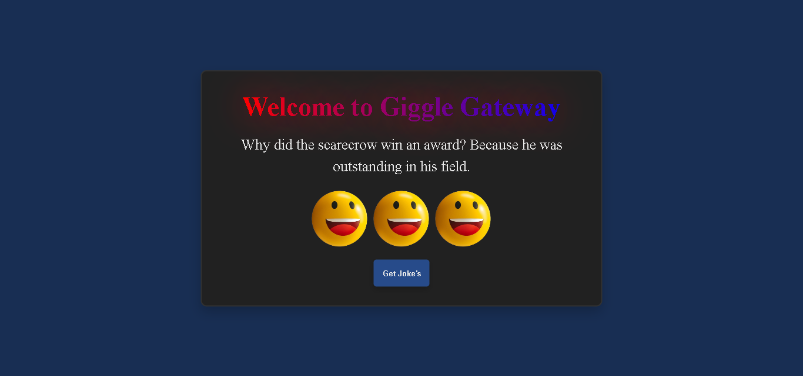

# Joke Generator 😊

Welcome to the Joke Generator project! This delightful mini JavaScript project is crafted to bring a grin to your face by fetching random jokes using the [icanhazdadjoke](https://icanhazdadjoke.com/) API.

[Live] (https://joke-generator-app-200.netlify.app/)



## How It Works

1. **HTML & CSS:**
   - The project boasts a simple HTML structure for the user interface, with tasteful styling using CSS to make it visually appealing.

2. **JavaScript:**
   - The magic unfolds with JavaScript, where we use the Fetch API to call the [icanhazdadjoke](https://icanhazdadjoke.com/) API and pluck a random dad joke.
   - The acquired joke then pirouettes onto the webpage, ready to tickle your funny bone.

3. **API Used:**
   - [icanhazdadjoke API](https://icanhazdadjoke.com/): This API graciously furnishes a bountiful collection of dad jokes that are bound to brighten your day.

## Getting Started

1. Clone or download the project to your local machine.
2. Open the `index.html` file in your preferred web browser.
3. Give the "Get Joke" button a gentle click to summon and display a random dad joke.
4. Revel in the laughter! 🎉

## Deployment on GitHub

To deploy this project on GitHub, follow these steps:

1. **Create a GitHub Repository:**
   - Create a new repository on GitHub.

2. **Clone the Repository:**
   - Clone your newly created repository to your local machine using the command:
     ```
     git clone https://github.com/ayeshasikander/Joke-Generator.git
     ```

3. **Copy Files:**
   - Copy all the files from the Joke Generator project into the local repository.

4. **Commit Changes:**
   - Add, commit, and push the changes to GitHub.
     ```
     git add .
     git commit -m "Initial commit"
     git push origin master
     ```

5. **GitHub Pages:**
   - Go to your GitHub repository.
   - Navigate to the "Settings" tab.
   - Scroll down to the "GitHub Pages" section.
   - Choose the branch you want to deploy (e.g., master).
   - Your Joke Generator is now live at `https://github.com/ayeshasikander/Joke-Generator.git`!


## Acknowledgments

A heartfelt thank you to the whimsical minds behind [icanhazdadjoke](https://icanhazdadjoke.com/) for generously supplying the laughter-infused material for this project.


Happy coding and keep on smiling! 😄